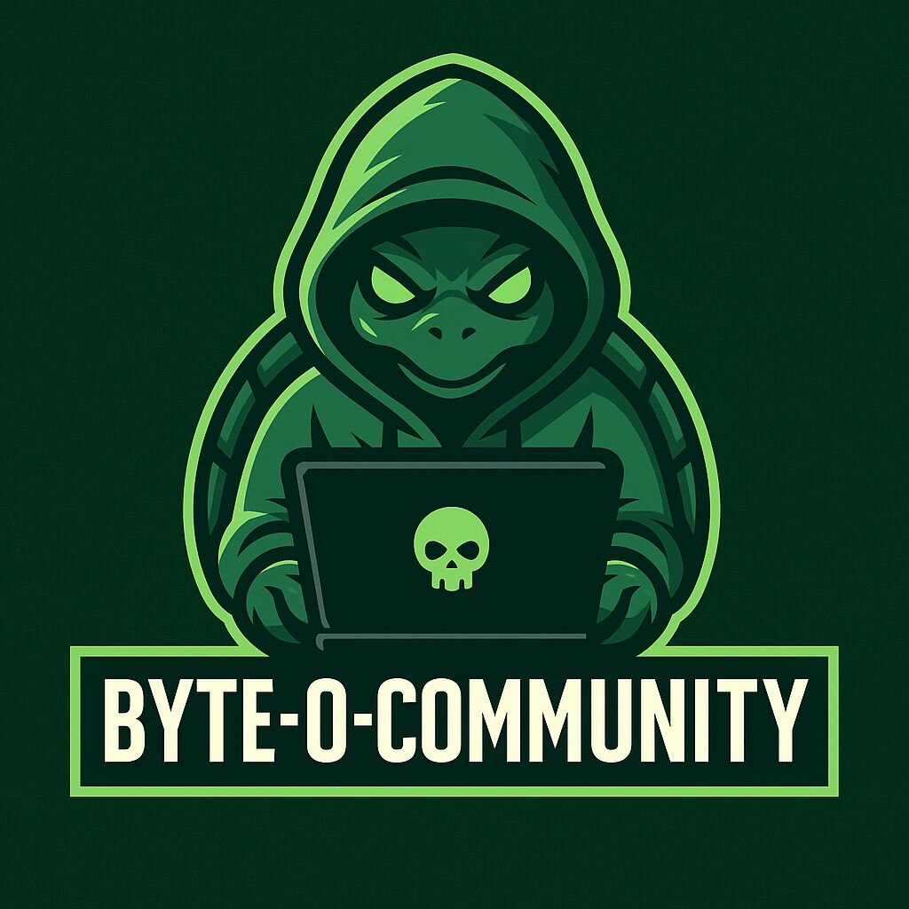

# 🛡️ Byte-o - Comunidad de Ciberseguridad

> **Descubre el arte del hacking ético y la seguridad informática**

## 🎯 Nuestra Misión

Byte-o es una comunidad dedicada al aprendizaje y desarrollo de habilidades en seguridad informática. Nos enfocamos en:

- 🛡️ Hacking ético y seguridad informática
- 🤝 Aprendizaje colaborativo
- 📚 Documentación y recursos técnicos
- 🚀 Proyectos de seguridad

## 🚀 ¿Qué Ofrecemos?

- 📚 Documentación técnica actualizada
- 🎮 CTFs y desafíos de hacking
- 🧠 Tutoriales y guías
- 🛠️ Scripts y herramientas útiles
- 📖 Bibliografía recomendada

## 🤝 Cómo Participar

1. 🎮 Únete a nuestro Discord para interactuar con la comunidad
2. 🤝 Contribuye con tu conocimiento
3. 🚀 Participa en nuestros proyectos

## 📋 Requisitos

- 📖 Respetar el código de conducta
- 🤝 Mantener un espíritu de colaboración
- 🛡️ Compartir conocimientos de manera ética
- 📝 Documentar tus contribuciones

## 📝 Licencia

Este repositorio está bajo la licencia MIT. Consulta el archivo LICENSE para más detalles.

## 🙏 Agradecimientos

A todos los miembros que contribuyen con su tiempo y conocimientos para hacer de Byte-o una comunidad vibrante y en constante crecimiento.

> **_"La seguridad no es un destino, es un viaje continuo"_**

---
